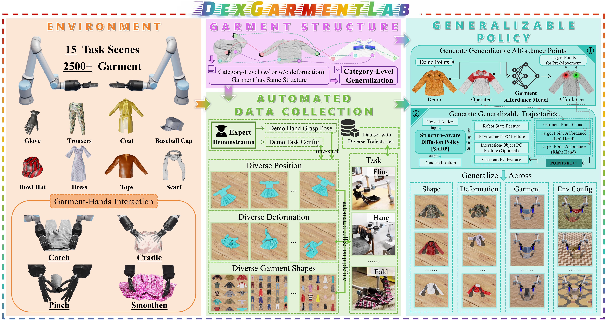
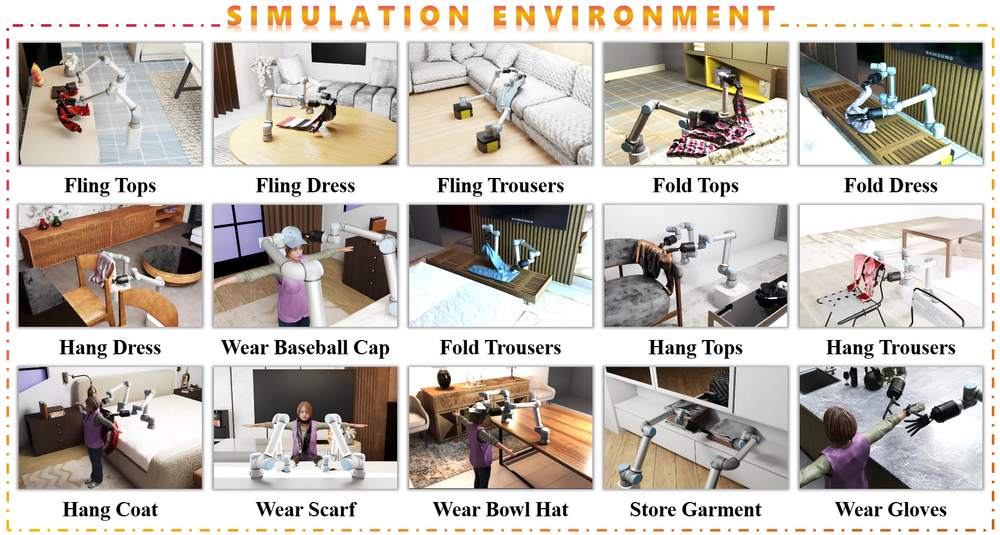

<h2 align="center">
  <b><tt>DexGarmentLab</tt>: <br>
  Dexterous Garment Manipulation Environment with <br>
  Generalizable Policy</b>
</h2>

<div align="center" margin-bottom="6em">
<b>Under Review</b>
</div>

<br>

<div align="center">
    <a href="https://github.com/wayrise/DexGarmentLab" target="_blank">
    </a>
    <a href="https://github.com/wayrise/DexGarmentLab" target="_blank">
    </a>
    <a href="https://github.com/wayrise/DexGarmentLab" target="_blank">
    </a>
</div>

<br>



**DexGarmentLab** includes three major components:
- **Environment**: We propose <u>Dexterous Garment Manipulation Environment</u> with 15 different task scenes (especially for bimanual coordination) based on 2500+ garments.
- **Automated Data Collection**: Because of the same structure of category-level garment, category-level generalization is accessible, which empowers our proposed <u>Automated Data Collection Pipeline</u> to handle different position, deformation and shapes of garment with task config (including grasp position and task sequence) and grasp hand pose provided by single expert demonstration.
- **Generalizable Policy**: With diverse collected demonstration data, we introduce <u> **H**ierarchical g**A**rment manipu**L**ation p**O**licy (**HALO**) </u>, combining affordance points and trajectories to generalize across different attributes in different tasks.

## 📢 MileStone

- [x] *(2025.04.25)* DexGarmentLab **Simulation Environment** Release ! 

- [x] *(2025.04.25)* DexGarmentLab **Automated Data Collection Pipeline** Release ! 

- [x] *(2025.05.09)* DexGarmentLab **Baselines and Generalizable Policy** Release !

- [x] *(2025.05.09)* DexGarmentLab **Policy Validation Environment** Release !

- [ ] DexGarmentLab **Dataset of Garment Manipulation Tasks** Coming Soon ... 


## 📖 Usage

**1. IsaacSim Download**

DexGarmentLab is built upon **IsaacSim 4.5.0**, please refer to [NVIDIA Official Document](https://docs.isaacsim.omniverse.nvidia.com/latest/installation/download.html) for download. 

```We recommend placing the Isaac Sim source folder at `~/isaacsim_4.5.0` to match the Python interpreter path specified in the `.vscode/settings.json` file we provide. If you prefer to use a custom location, please make sure that the Python interpreter path in `.vscode/settings.json` is updated accordingly.```

We will use **~/isaacsim_4.5.0/python.sh** to run the isaacsim's python file. To facilitate the running, we can define a new alias in '.bashrc' file.

```bash
echo 'alias isaac="~/isaacsim_4.5.0/python.sh"' >> ~/.bashrc
source ~/.bashrc
```
**2. Pull Repo**

```bash
git clone git@github.com:wayrise/DexGarmentLab.git
```

**3. Project Assets Download**

DownLoad ***Garment*** directory (necessary assets used in this repo) from [Google Drive Link](https://drive.google.com/drive/folders/1EWH9zYQfBa96Z4JyimvUSBYOyW615JSg) which are provided by [GarmentLab](https://github.com/GarmentLab/GarmentLab), Thanks for GarmentLab's contribution!

Download ***Robots*** and ***Scene*** directory from [Google Drive Link](https://drive.google.com/drive/folders/1tMm_z8O1z3M7jRzhEJQQ3xQsi89XiK3e?usp=sharing).

Put them all in the '**Assets**' Directory. 

**4. Additional Environment Dependencies for Project**

```bash
isaac -m pip install -r requirements.txt
```


## 🏕️ Simulation Environment



We introduce 15 garment manipulation tasks across 8 categories, encompassing: 

- **Garment-Self-Interaction Task**: ```Fling Tops```, ```Fling Dress```, ```Fling Trousers```, ```Fold Tops```, ```Fold Dress```, ```Fold Trousers```. The key variables include **garment position**, **orientation**, and **shape**.

- **Garment-Environment-Interaction Task**: ```Hang Dress```, ```Hang Tops```, ```Hang Trousers```, ```Hang Coat```, ```Wear Scarf```, ```Wear Bowl Hat```, ```Wear Baseball Cap```, ```Wear Glove```, ```Store Tops```. The key variables include **garment position**, **garment orientation**, **garment shape** and **environment-interaction assets positions** (e.g., hangers, pothooks, humans, etc.)

you can run python files in 'Env_StandAlone' using following commands:

```bash
# e.g. Fixed Garment Shape, Position, Orientation and Environment Assets Position
isaac Env_StandAlone/Hang_Coat_Env.py

# There are some args you can choose
# 1. --env_random_flag : 
#   True/False, Whether enable environment randomization (including position)
#   This flag only work when task belongs to Garment-Environment-Interaction Task
# 2. --garment_random_flag: 
#   True/False, Whether enable garment randomization (including position, orientation, shape)
# 3. --record_vedio_flag: 
#   True/False, Whether record whole-procedure vedio.
# 4. --data_collection_flag: 
#   True/False, Whether collect data (for policy training).

# e.g.
isaac Env_StandAlone/Hang_Coat_Env.py --env_random_flag True --garment_random_flag True 
# means in Hang_Coat_Env, enable environment and garment randomization and execute the program.
```

## ⚒️ Automated Data Collection

Autually our data collection procedure has been embedded into **Env_StandAlone/<Task_Name>_Env.py** mentioned above. The only required step is to set **--data_collection_flag** to **True**.

We provide **Data_Collection.sh** for convenience:

```bash
# usage template: bash Data_Collection.sh <task_name> <demo_num>
# e.g.
bash Data_Collection.sh Hang_Coat 10

# 10 pieces of data will be saved into 'Data/Hang_Coat'.
# including:
# - final_state_pic: .png file, picture of final garment state, used for manual verification of task success.
# - train_data: .npz file, used for training data storage.
# - vedio: .mp4 file, recording whole-procedure vedio.
# - data_collection_log.txt: recording data collection result,  corresponding assets and task configurations.
```

You can also download our prepared data from [huggingface]() and put them into **Data** folder.


## 🚀 Generalizable Policy

Our policy **HALO** consists: 
- **Garment Affordance Model (GAM)**, which is used to generate target manipulation points for robot's movement. The corrsponding affordance map will also be used as denosing condition for SADP.
- **Structure-Aware Diffusion Policy (SADP)**, which is used to generate robot's subsequent movement aware of garment's structure after moving to the target manipulation points.

They can be found all in **'Model_HALO/'** directory.

### GAM

The file structure of GAM is as follows:

```
GAM/
├── checkpoints/    # checkpoints of trained GAM for different category garment
    ├──Tops_LongSleeve/     # garment category
        ├──assets_list.txt           # list of assets used for validation
        ├──assets_training_list.txt  # list of assets used for training
        ├──checkpoint.pth            # trained model
        ├──demo_garment.ply          # demo garment point cloud
    ......
    ├──Trousers/
├── model                   # meta files of GAM
├── GAM_Encapsulation.py    # encapsulation of GAM
```

For the detailed use of GAM, please refer to [GAM_Usage](https://github.com/wayrise/DexGarmentLab/blob/main/GAM_Usage.md). The files in **'Env_StandAlone/'** also provide example of how to use GAM.

### SADP

SADP is suitable for **Garment-Environment-Interaction tasks**. All the related tasks only have one stage.

1. **Installation**
```bash
cd Model_HALO/SADP

isaac -m pip install -e .
```

2. **Data Preparation**

We need to pre-process *.npz* data collected in **'Data/'** to *.zarr* data for training. 

The only thing you need to do is just runing '*data2zarr_sadp.sh*' in 'Model_HALO/SADP'.

```bash
cd Model_HALO/SADP

# usage template: 
# bash data2zarr_sadp.sh <task_name> <stage_index> <train_data_num>
bash data2zarr_sadp.sh Hang_Coat 1 100

# Detailed parameters information can be found in the 'data2zarr_sadp.sh' file
```

The processed data will be saved in 'Model_HALO/SADP/data'. If you wanna train SADP in your headless service, please move the data to the same position.

3. **Training**

```bash
cd Model_HALO/SADP

# usage template: 
# python train.py <task_name> <expert_data_num> <seed> <gpu_id> <DEBUG_flag>
bash train.sh Hang_Coat_stage_1 100 42 0 False

# Detailed parameters information can be found in the 'train.sh' file
# Before training, we recommend you to set DEBUG_flag to True to check the training process.
```

The checkpoints will be saved in 'Model_HALO/SADP/checkpoints'.

### SADP_G

SADP_G is suitable for **Garment-Self-Interaction tasks**, which means the denosing conditions exclude interaction-object point cloud. **Fold_Tops** and **Fold_Dress** have three stages. **Fold_Trousers**, **Fling_Dress**, **Fling_Tops** have two stages. **Fling_Trousers** only have one stage.

All the procedure are the same as SADP.

1. **Installation**
```bash
cd Model_HALO/SADP_G

isaac -m pip install -e .
```

2. **Data Preparation**
```bash
cd Model_HALO/SADP

# usage template: 
# bash data2zarr_sadp_g.sh <task_name> <stage_index> <train_data_num>
bash data2zarr_sadp_g.sh Fold_Tops 2 100

# Detailed parameters information can be found in the 'data2zarr_sadp_g.sh' file
```

3. **Training**

```bash
cd Model_HALO/SADP_G

# usage template: 
# python train.py <task_name> <expert_data_num> <seed> <gpu_id> <DEBUG_flag>
bash train.sh Fold_Tops_stage_2 100 42 0 False

# Detailed parameters information can be found in the 'train.sh' file
# Before training, we recommend you to set DEBUG_flag to True to check the training process.
```

## 🎯 IL_BASELINES

Here support two IL baselines: **Diffusion Policy**, **Diffusion Policy 3D**. Their usages are the same as SADP.

### Diffusion Policy

1. Installation

```bash
cd IL_Baselines/Diffusion_Policy

isaac -m pip install -e .
```

2. Data Preparation

```bash

cd IL_Baselines/Diffusion_Policy

bash data2zarr_dp.sh Hang_Tops 1 100
```

3. Train

```bash

cd IL_Baselines/Diffusion_Policy

bash train.sh Hang_Tops_stage_1 100 42 0 False
```

### Diffusion Policy 3D

1. Installation

```bash
cd IL_Baselines/Diffusion_Policy_3D

isaac -m pip install -e .
```

2. Data Preparation

```bash
cd IL_Baselines/Diffusion_Policy_3D

bash data2zarr_dp3.sh Hang_Dress 1 100
```

3. Training

```bash
cd IL_Baselines/Diffusion_Policy_3D

bash train.sh Hang_Dress_stage_1 100 42 0 False
```

## 🪄 Policy Validation

We provide HALO Validation file for all the tasks in 'Env_Validation/' folder. We provide 'Validation.sh' to validate the policy for different tasks.

```bash
# usage template:
# bash Validation.sh <task_name> <validation_num> <training_data_num>
bash Validation.sh Hang_Coat 100 100

# Detailed parameters information can be found in the 'Validation.sh' file
```

You can find how to load checkpoints and validate the policy through the code and we summarize core code below.

1. SADP
```python
# load package
from Model_HALO.SADP.SADP import SADP

# load model
sadp = SADP(task_name="Hang_Coat_stage_1", data_num=100, checkpoint_num=3000)

# input organization
obs = dict()
obs['agent_pos']=XXX
obs['environment_point_cloud']=XXX
obs['garment_point_cloud']=XXX
obs['object_point_cloud']=XXX
obs['points_affordance_feature']=XXX

# get action or update obs
action=sadp.get_action(obs) # or sadp.update_obs(obs)
```

2. SADP_G
```python
# load package
from Model_HALO.SADP_G.SADP_G import SADP_G

# load model
sadp_g = SADP_G(task_name="Hang_Coat_stage_1", data_num=100, checkpoint_num=3000)

# input organization
obs = dict()
obs['agent_pos']=XXX
obs['environment_point_cloud']=XXX
obs['garment_point_cloud']=XXX
obs['points_affordance_feature']=XXX

# get action or update obs
action=sadp_g.get_action(obs) # or sadp_g.update_obs(obs)
```

3. DP3
```python
# load package
from IL_Baselines.Diffusion_Policy_3D.DP3 import DP3

# load model
dp3 = DP3(task_name="Hang_Coat_stage_1", data_num=100, checkpoint_num=3000)

# input organization
obs = dict()
obs['agent_pos']=XXX
obs['point_cloud']=XXX

# get action or update obs
action=dp3.get_action(obs) # or dp3.update_obs(obs)
```

4. DP
```python
# load package
from IL_Baselines.Diffusion_Policy.DP import DP

# load model
dp = DP(task_name="Hang_Coat_stage_1", data_num=100, checkpoint_num=3000)

# input organization
obs = dict()
obs['agent_pos']=XXX
obs['head_cam']=np.moveaxis(RGB_numpy, -1, 0) / 255.0

# get action or update obs
action=dp.get_action(obs) # or dp.update_obs(obs)
```

## 🔐 Task Extension