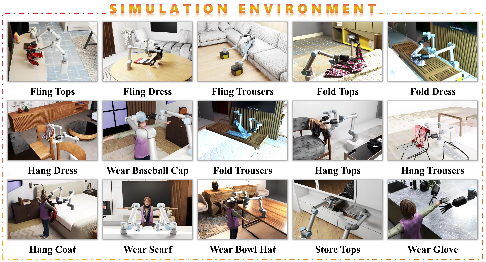

<h2 align="center">
  <b><tt>DexGarmentLab</tt>: <br>
  Dexterous Garment Manipulation Environment with <br>
  Generalizable Policy</b>
</h2>

## 🗺️ Overview


**DexGarmentLab** includes three major components:
- **Environment**: We propose <u>Dexterous Garment Manipulation Environment</u> with 15 different task scenes (especially for bimanual coordination) based on 2500+ garments.
- **Automated Data Collection**: Because of the same structure of category-level garment, category-level generalization is accessible, which empowers our proposed <u>Automated Data Collection Pipeline</u> to handle different position, deformation and shapes of garment with task config (including grasp position and task sequence) and grasp hand pose provided by single expert demonstration.
- **Generalizable Policy**: With diverse collected demonstration data, we introduce <u> **H**ierarchical g**A**rment manipu**L**ation p**O**licy (**HALO**) </u>, combining affordance points and trajectories to generalize across different attributes in different tasks.

## 📢 MileStone

- [x] *(2025.04.25)* DexGarmentLab **Simulation Environment** Release ! 

- [x] *(2025.04.25)* DexGarmentLab **Automated Data Collection Pipeline** Release ! 

- [ ] DexGarmentLab **Dataset of Garment Manipulation Tasks** Coming Soon ... 

- [ ] DexGarmentLab **Baselines and Generalizable Policy** Coming Soon ...

- [ ] DexGarmentLab **Policy Validation Environment** Coming Soon ...

## 📖 Usage

**1. IsaacSim Download**

DexGarmentLab is built upon **IsaacSim 4.5.0**, please refer to [NVIDIA Official Document](https://docs.isaacsim.omniverse.nvidia.com/latest/installation/download.html) for download. 

```We recommend placing the Isaac Sim source folder at `~/isaacsim_4.5.0` to match the Python interpreter path specified in the `.vscode/settings.json` file we provide. If you prefer to use a custom location, please make sure that the Python interpreter path in `.vscode/settings.json` is updated accordingly.```

We will use **~/isaacsim_4.5.0/python.sh** to run the isaacsim's python file. To facilitate the running, we can define a new alias in '.bashrc' file.

```bash
echo 'alias isaac="~/isaacsim_4.5.0/python.sh"' >> ~/.bashrc
source ~/.bashrc
```
**2. Pull Repo**

```bash
git clone git@github.com:wayrise/DexGarmentLab.git
```

**3. Project Assets Download**

DownLoad ***Garment*** directory (necessary assets used in this repo) from [Google Drive Link](https://drive.google.com/drive/folders/1EWH9zYQfBa96Z4JyimvUSBYOyW615JSg) which are provided by [GarmentLab](https://github.com/GarmentLab/GarmentLab), Thanks for GarmentLab's contribution!

Download ***Robots*** and ***Scene*** directory from [Google Drive Link](https://drive.google.com/drive/folders/1tMm_z8O1z3M7jRzhEJQQ3xQsi89XiK3e?usp=sharing).

Put them all in the '**Assets**' Directory. 

**4. Additional Environment Dependencies for Project**

```bash
isaac -m pip install -r requirements.txt
```


## 🏕️ Simulation Environment



We introduce 15 garment manipulation tasks across 8 categories, encompassing: 

- **Garment-Self-Interaction Task**: ```Fling Tops```, ```Fling Dress```, ```Fling Trousers```, ```Fold Tops```, ```Fold Dress```, ```Fold Trousers```. The key variables include **garment position**, **orientation**, and **shape**.

- **Garment-Environment-Interaction Task**: ```Hang Dress```, ```Hang Tops```, ```Hang Trousers```, ```Hang Coat```, ```Wear Scarf```, ```Wear Bowl Hat```, ```Wear Baseball Cap```, ```Wear Gloves```, ```Store Garment```. The key variables include **garment position**, **garment orientation**, **garment shape** and **environment-interaction assets positions** (e.g., hangers, pothooks, humans, etc.)

you can run python files in 'Env_StandAlone' using following commands:

```bash
# e.g. Fixed Garment Shape, Position, Orientation and Environment Assets Position
isaac Env_StandAlone/Hang_Coat_Env.py

# There are some args you can choose
# 1. --env_random_flag : 
#   True/False, Whether enable environment randomization (including position)
#   This flag only work when task belongs to Garment-Environment-Interaction Task
# 2. --garment_random_flag: 
#   True/False, Whether enable garment randomization (including position, orientation, shape)
# 3. --record_vedio_flag: 
#   True/False, Whether record whole-procedure vedio.
# 4. --data_collection_flag: 
#   True/False, Whether collect data (for policy training).

# e.g.
isaac Env_StandAlone/Hang_Coat_Env.py --env_random_flag True --garment_random_flag True 
# means in Hang_Coat_Env, enable environment and garment randomization and execute the program.
```

## ⚒️ Automated Data Collection

Autually our data collection procedure has been embedded into **Env_StandAlone/<Task_Name>_Env.py** mentioned above. The only required step is to set **--data_collection_flag** to **True**.

We provide **Data_Collection.sh** for convenience:

```bash
# usage template: bash Data_Collection.sh <task_name> <demo_num>
# e.g.
bash Data_Collection.sh Hang_Coat 10

# 10 pieces of data will be saved into 'Data/Hang_Coat'.
# including:
# - final_state_pic: .png file, picture of final garment state, used for manual verification of task success.
# - train_data: .npz file, used for training data storage.
# - vedio: .mp4 file, recording whole-procedure vedio.
# - data_collection_log.txt: recording data collection result,  corresponding assets and task configurations.
```

## Coming Soon ...


<!-- ## IL_BASELINES

Here support two IL baselines: **Diffusion Policy**, **Diffusion Policy 3D**.

### Diffusion Policy

1. Installation

    ```bash
    cd IL_Baselines/Diffusion_Policy

    omni_isaac -m pip install -e .
    ```

2. Data Preparation

    We need to pre-process *.npz* data collected in Env_Replay to *.zarr* data for training. 
    
    The only things you need to do is just runing '*data2zarr_dp.sh*' in 'IL_Baselines/Diffusion_Policy'.

    ```bash
    # detailed information has been added in the script
    # Here list one example

    cd IL_Baselines/Diffusion_Policy

    bash data2zarr_dp.sh Hang_Tops 1 100
    ```

    The processed data will be saved in 'IL_Baselines/Diffusion_Policy/data'. If you wanna train IL in your headless service, please move the data to the same position.

3. Train

    ```bash
    # detailed information has been added in the script
    # Here list one example

    cd IL_Baselines/Diffusion_Policy

    bash train.sh Hang_Tops_stage_1 100 42 0 False
    ```

4. Config_Customization

    you can change some configuration about dp training in 'IL_Baselines/Diffusion_Policy/diffusion_policy/config'.


### Diffusion Policy 3D

1. Install

    ```bash
    cd IL_Baselines/Diffusion_Policy_3D

    omni_isaac -m pip install -e .
    ```

2. Data Preparation

    We need to pre-process *.npz* data collected in Env_Replay to *.zarr* data for training. 
    
    The only things you need to do is just runing '*data2zarr_dp3.sh*' in 'IL_Baselines/Diffusion_Policy_3D'.

    ```bash
    # detailed information has been added in the script
    # Here list one example

    cd IL_Baselines/Diffusion_Policy_3D

    bash data2zarr_dp3.sh Hang_Tops 1 100
    ```

    The processed data will be saved in 'IL_Baselines/Diffusion_Policy_3D/data'. If you wanna train IL in your headless service, please move the data to the same position.

3. Train

    ```bash
    # detailed information has been added in the script
    # Here list one example

    cd IL_Baselines/Diffusion_Policy_3D

    bash train.sh Hang_Tops_stage_1 100 42 0 False
    ```

4. Config_Customization

    you can change some configuration about dp training in 'IL_Baselines/Diffusion_Policy_3D/diffusion_policy_3d/config'.


## GIF -> Video

Install FFMPEG first.
```bash
sudo apt update
sudo apt-get install ffmpeg
```
Then you can convert the gif to mp4 by the following command.
```bash
ffmpeg -i input.gif(need change) -movflags faststart -pix_fmt yuv420p -vf "scale=trunc(iw/2)*2:trunc(ih/2)*2,setpts=PTS/2" output.mp4(need change)
```

you can also use 'gif2mp4.sh' to convert the gif to mp4. Detailed information has been added in the script. Here list one example.
```bash
bash Scripts/gif2mp4.sh FoldTrousers 0
```

 -->
